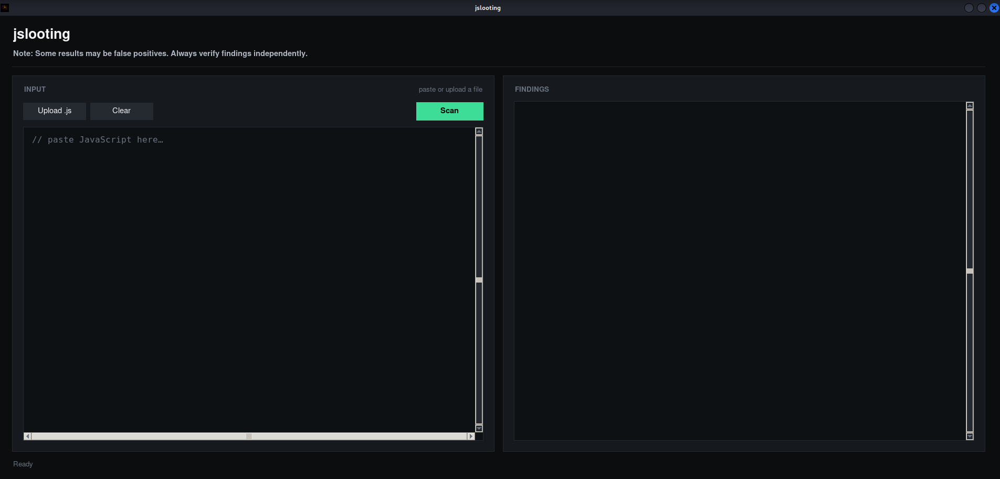
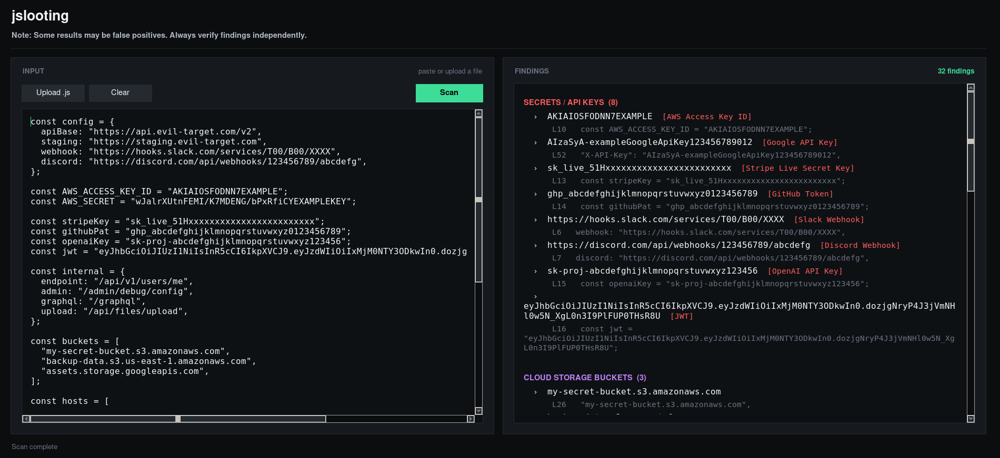
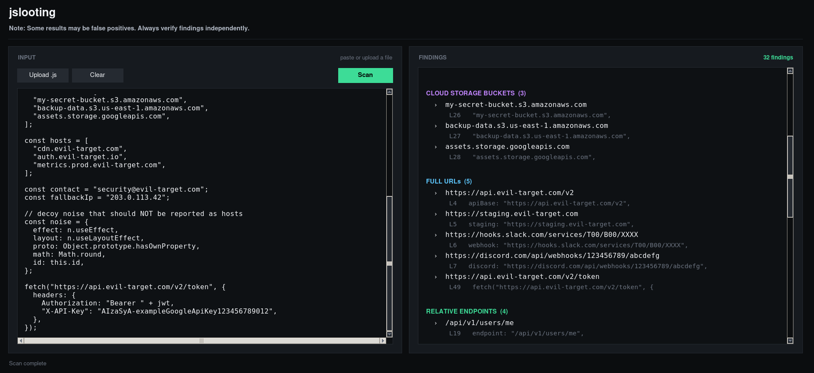
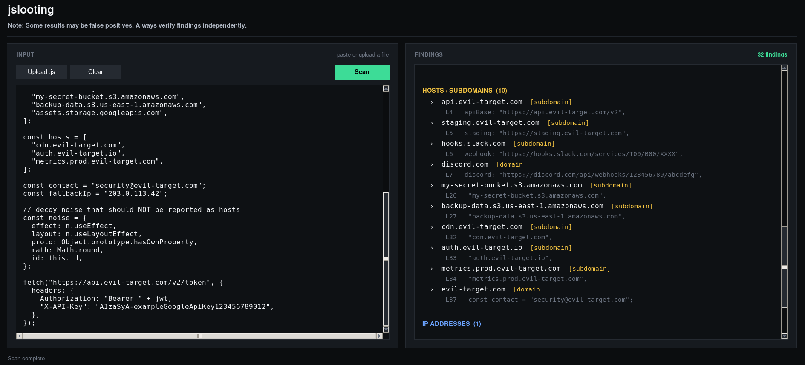
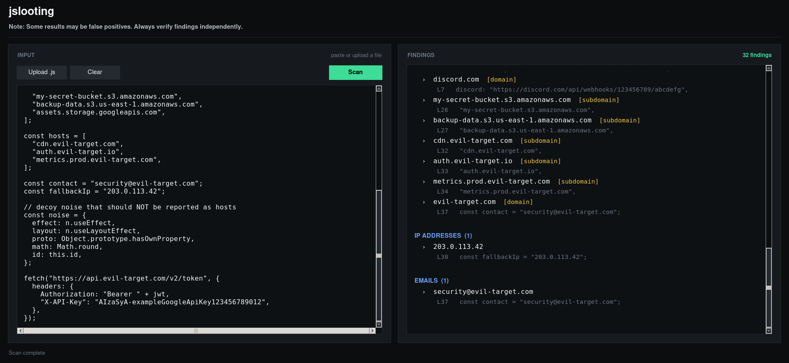

### Disclaimer
This tool is provided for **authorized security research and educational purposes only**.
- Only use this tool on systems you own or have explicit written permission to test
- The authors assume no liability for misuse or damage caused by this tool
- Users are responsible for complying with all applicable local, state, and federal laws
- This tool comes with no warranty — use at your own risk
By using this software, you agree that you will not use it for any illegal or unauthorized activities.

### About

**JSlooting is a tool built for authorized penetration tests and security research.** 
> ***Please note that some of the tool's results might be false positives***

A look at the tool:


### Usage

Upload `.js` file or just paste its contents into the tool, then press `Scan` and the tool will search for:
- Secrets / API Keys
- URLs
- Relative endpoints
- Cloud storage buckets
- IPs & Emails
- Hosts/Subdomains
And show the output in the **FINDINGS** section. 

**Output showcase**:




Press `Clear` button to clear the contents of current input. 

### Prerequisites
- Python **3.7+** (3.9+ recommended) 
- `tkinter`

### Installation + Usage
```
git clone https://github.com/SAsecurityN/JSlooting.git
cd JSlooting

# Use the tool:
python3 jslooting.py
```

### LICENSE 
[MIT](LICENSE)


